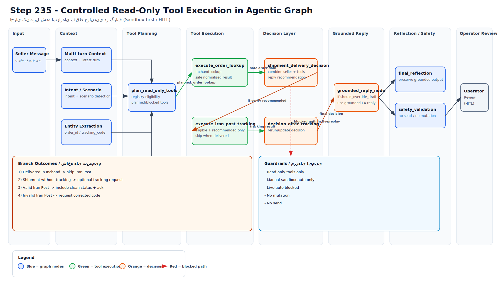

# Agentic Graph Read-Only Tools Workflow (Step 235–236)

This diagram documents the Step 235 graph path that executes operational tools in a controlled way:

- `plan_read_only_tools` checks source mode + config + registry eligibility.
- `execute_order_lookup` runs Inchand order lookup only when planned/eligible.
- `shipment_delivery_decision` computes grounded operational decision.
- `execute_iran_post_tracking` runs only when recommended, eligible, and not delivered in Inchand.
- `shipment_delivery_decision_after_tracking` updates decision using tracking outcome.
- `grounded_reply` overrides draft when decision says `should_override_draft=true`.

Step 236 extension (manual sandbox only): when multiple order IDs are present in shipment/delivery context, the workflow performs bounded per-order read-only lookups and aggregates per-order shipment decisions into a compact grounded reply and PII-safe debug summary.



## Safety boundaries

- Read-only only: no write/mutation/send actions.
- Auto tool execution allowed only for `manual_sandbox_chat`.
- Live feed and historical replay keep graph auto execution blocked.
- Registry eligibility (`evaluate_tool_eligibility`) is mandatory for every tool call.
- Reporting/UI expose safe metadata only (no raw API payloads, tokens, or PII).
- Multi-order batches are capped by `MULTI_ORDER_BATCH_MAX_AUTO_LOOKUP`; over-limit batches skip mass lookup and return compact registration reply.

## Optional PNG export

For local preview as PNG:

```bash
PYTHONPATH=. python3.11 scripts/export_workflow_svg_to_png.py --scale 2
```
